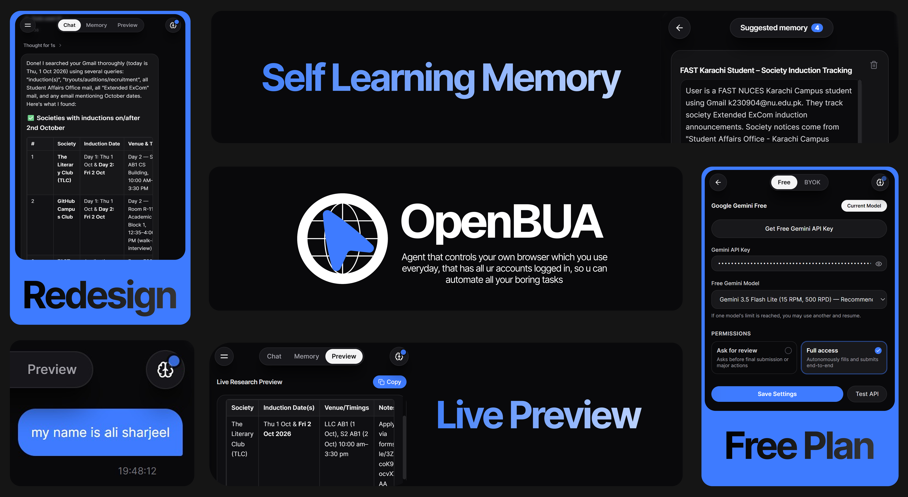

<p align="center">
  
</p>

<p align="center">
  
  <br />
  <sub>OpenBUA was asked to "Find me 2 students from Australia using Linkedin and email them selling my app Petedoro"</sub>
</p>

---

**OpenBUA** is an open-source, autonomous browser use Chrome Extension (Manifest V3) that runs directly inside your everyday browser. Unlike cloud browser-use tools that require spun-up headless containers, login bypass proxies, or remote servers, OpenBUA operates right inside your existing Chrome instance with all your active sessions, cookies, and logins already available.

Built with **`@earendil-works/pi-agent-core`** and **`@earendil-works/pi-ai`**, OpenBUA equips AI models with real-time DOM perception, intelligent multi-step navigation, native synthetic event form-filling, live streaming research preview, and a proactive self-learning memory system.

---

## What Can OpenBUA Do?

Because OpenBUA runs directly in your existing browser, it can perform complex autonomous workflows without needing you to log in again:

- **Autonomous Web Research and Lead Generation**:
  - Search directories, platforms, or search engines across multiple pages.
  - Evaluate candidates, extract relevant details, and compile findings into clean tables.
  - Example: *"Search LinkedIn for 'world models PhD' researchers, extract profiles across pages, and compile a structured table with names, headlines, and locations."*
  - Example: *"Go through recent Hacker News submissions on LLM agents, find the top 5 discussions, and summarize key takeaways."*

- **Live Research Preview Tab**:
  - Features a dedicated Preview view accessible from the central Chat / Memory / Preview toggle.
  - Streams extracted findings, candidate rows, and structured Markdown into the preview buffer incrementally as items are discovered (ReAct 1-item cycle), without making you wait for the full task to finish.
  - Includes an automatic markdown table repair engine that stitches fragmented rows and scattered pipe data into contiguous tables.
  - Per-chat scoping ensures every conversation tab maintains its own independent preview buffer with an instant Markdown copy button.

- **Self-Learning Memory System**:
  - Automatically identifies personal facts, contact information, university affiliations, and repeatable workflow patterns while executing tasks.
  - Queues discovered facts into a dedicated Suggested Memories interface where you can review them, discard with a single tap, or approve them into Tab Memory or Global Memory.
  - Global Memory stores general user background (profile, resume, work history) across all browser tabs.
  - Tab Memory isolates project-specific context and uploaded documents to the active chat session.
  - Direct file uploads for PDF, Markdown, Text, and JSON documents with client-side text extraction powered by `pdfjs-dist`.

- **Autonomous Form Filling and Wizard Completion**:
  - Automatically matches web forms, job application portals (Greenhouse, Lever, Workday), and onboarding wizards against your stored profile.
  - Dispatches native synthetic event chains (`input`, `change`, `blur`) to ensure complete compatibility with React, Vue, Angular, Svelte, and vanilla HTML forms.
  - Verifies DOM inputs after population to guarantee submission accuracy.

- **Autonomous Email and Webmail Outreach (Gmail, Outlook, Webmail)**:
  - Drafts, reviews, and sends genuine emails right from your existing, logged-in browser session (Gmail, Outlook, Yahoo, webmail). No third-party OAuth permissions, SMTP passwords, or external email APIs required.
  - Navigates to your webmail interface, opens compose dialogs, inputs recipient chips, formats subject lines and body text, and clicks Send on your command.
  - Includes intelligent Gmail Basic HTML mode navigation to eliminate DOM drift and click friction on dynamic Single-Page Applications.

- **Multi-Tab Orchestration and Dynamic Automation**:
  - Opens, switches, and coordinates across browser tabs during multi-step workflows without losing current task progress or form context.
  - Paginated scraping, scrolling dynamically to trigger lazy-loaded elements, and interacting with buttons, dropdowns, and dialogs.

- **Human-in-the-Loop (HITL) CAPTCHA Handling**:
  - Detects bot verification challenges (Cloudflare Turnstile, Google reCAPTCHA, hCaptcha, Arkose Labs) on visited sites.
  - Displays a clean in-panel alert allowing you to solve the challenge manually, then automatically resumes automation upon completion.
  - Employs intelligent fallbacks and exploration budgets to prevent infinite navigation loops.

- **Chain-of-Thought Reasoning and Thinking Traces**:
  - Streams full model reasoning steps live in the side panel before executing browser actions.
  - Clean collapsible thought blocks provide transparency into what the agent is planning next.

---

## AI Models and Providers

OpenBUA supports both zero-cost free operation and flexible Bring Your Own Key (BYOK) providers:

### Google Gemini Free Mode
- **Zero-Cost Access**: Try OpenBUA completely free without paid API subscriptions or credit card billing.
- **Powered by Gemini 3.5 Flash Lite**: Default high-limit free model with automatic rate-limit backoff and pacing (up to 1,500 requests per day).
- **Direct Free Key Access**: Built-in 1-click link to generate your personal free API key directly from Google AI Studio.
- **Full Reasoning Support**: Streams structured chain-of-thought blocks before each browser action.

### Bring Your Own Key (BYOK)
- **OpenAI Compatible**: Connect to OpenAI (GPT-6 Astra, 6.1 Sol, 6 Luna, GPT-4o), Groq, OpenRouter, DeepSeek, or local Ollama instances.
- **Anthropic Compatible**: Connect to Anthropic (Claude Opus 5.5, Sonnet 5.5, Fable 5.1) or MiniMax.
- **Role Normalization and Connection Testing**: Built-in 1-click connection verification and automatic schema adaptation across providers.

---

## Key Architectural Highlights

- **Runs in Your Existing Browser**: No headless emulators, remote browsers, or virtual containers. OpenBUA leverages your everyday authenticated sessions (Google, GitHub, LinkedIn, Twitter/X, internal intranets).
- **100% Client-Side and Zero Backend**: Executes completely client-side in Chrome's Side Panel. Your API keys, browsing data, and documents never touch a third-party application server.
- **Universal Browser Compatibility**: Runs seamlessly on Google Chrome, Brave, Arc Browser, and Microsoft Edge with side panel support.
- **Multi-Tab Chat Sessions**: Create multiple concurrent chat sessions with individual persistent history stored in `chrome.storage.local`. Reloading or closing pages in Chrome never wipes your conversation history.
- **Clean Dark Zinc Interface**: Designed with Tailwind CSS shades of zinc, crisp Inter typography, and Apple-inspired accent elements.

---

## Quick Installation Guide (For New Users)

No technical knowledge or coding required. Follow these steps to install OpenBUA in your browser in under 2 minutes:

### Step 1: Download the Pre-Built Extension
1. Go to the [Releases](https://github.com/AliSharjeell/OpenBUA/releases) page.
2. Under the latest release, click on **`OpenBUA-v1.6.0.zip`** (or **`OpenBUA-extension.zip`**) to download it.
3. Unzip the downloaded file to a folder on your computer. You will see a folder containing `manifest.json`, `sidepanel.html`, etc.

### Step 2: Open Chrome Extensions and Enable Developer Mode
1. Open Google Chrome.
2. In the address bar, navigate to `chrome://extensions` and press **Enter** (or open the menu at top-right -> **Extensions** -> **Manage Extensions**).
3. In the top-right corner of the Extensions page, switch the **Developer mode** toggle to **ON**.
   - Note: "Developer mode" is a free built-in setting available in every copy of Chrome that allows loading local extensions.

### Step 3: Load the Extension
1. After enabling Developer mode, click the **Load unpacked** button in the top-left corner.
2. Select the unzipped folder containing `manifest.json` (the folder extracted in Step 1).
3. Click **Select Folder**.
4. OpenBUA is now installed. Click the puzzle icon (Extensions) in your Chrome toolbar and pin **OpenBUA** for quick access.

### Step 4: Configure Your AI Key
1. Click the **OpenBUA** icon on your Chrome toolbar to open the Side Panel.
2. Click the **Settings** tab.
3. Choose your configuration:
   - **Google Gemini (Free)**: Click "Get a free Gemini API key", paste your key, and select Gemini 3.5 Flash Lite.
   - **BYOK**: Select OpenAI Compatible or Anthropic Compatible, paste your API key, and specify your model ID.
4. Click **Test Connection** to confirm connectivity, then click **Save Settings**.

---

## Alternative: Build from Source (For Developers)

If you prefer to build the extension from source:

```bash
git clone https://github.com/AliSharjeell/OpenBUA.git
cd OpenBUA
npm install
npm run build
```

Then in `chrome://extensions` with Developer mode enabled, click **Load unpacked** and select the `dist` folder.

---

## Architecture

```
OpenBUA/
├── manifest.json              # Chrome Manifest V3 configuration
├── sidepanel.html             # Side Panel HTML entry
├── vite.config.ts             # Vite build configuration
├── tailwind.config.js         # Dark-zinc palette and Inter font theme
├── scripts/
│   ├── build-extension.js     # Production build and bundling pipeline
│   └── generate-icons.js      # Extension icons generator
├── src/
│   ├── background/
│   │   └── service-worker.ts  # MV3 service worker and side panel launcher
│   ├── content/
│   │   └── content-script.ts  # DOM scanner, native input setter and event dispatcher
│   ├── agent/
│   │   ├── form-agent.ts      # Main agent harness wrapping pi-agent-core Agent
│   │   ├── stream-adapter.ts  # BYOK streaming adapter (OpenAI, Gemini, Anthropic SSE)
│   │   ├── tools.ts           # Browser use tool schemas and executors
│   │   └── browser-bridge.ts  # Chrome tabs and scripting communication bridge
│   ├── services/
│   │   ├── storage.ts         # Scoped local storage service (chrome.storage.local)
│   │   └── pdf-parser.ts      # In-browser PDF and text extractor
│   ├── components/
│   │   ├── ChatView.tsx       # Main chat interface with tool visualizer and file uploader
│   │   ├── MemoryView.tsx     # Global and Tab memory manager with toggle controls
│   │   ├── PreviewView.tsx    # Live research preview tab with streaming markdown
│   │   ├── SuggestedMemoriesView.tsx # Self-learning proactive memory suggestion view
│   │   ├── VaultView.tsx      # Secure credential and profile vault interface
│   │   ├── SettingsView.tsx   # Free Gemini and BYOK provider settings
│   │   ├── MarkdownRenderer.tsx # GitHub Flavored Markdown renderer with table repair
│   │   └── ui/                # UI component primitives (Button, Input, Card, Badge)
│   ├── sidepanel/
│   │   ├── App.tsx            # Application root with persistent chat session tabs
│   │   └── main.tsx           # React entry point
│   └── types/
│       └── index.ts           # TypeScript interfaces and contracts
└── test-form.html             # Multi-step test form for verification
```

---

## Usage Examples

### 1. Autonomous Form Filling
Open any web form (or open `test-form.html` in Chrome) and click the **Fill active form automatically** button above the input bar, or ask:
```
Inspect the form on this page, match it against my stored profile, and fill in all fields.
```
OpenBUA will inspect the DOM, retrieve matching data from your memory store, fill the fields using native synthetic events, and report what was filled.

### 2. Deep Web Research with Live Preview
Navigate to any directory, search results page, or social platform and ask:
```
Search for 'world models PhD' researchers, go through the results pages, and extract a table containing name, current affiliation, and location.
```
Switch to the **Preview** tab in the top navigation to watch candidate rows stream into a formatted markdown table in real time as the agent navigates.

### 3. Real Email Outreach from Your Signed-in Email Client (Gmail, Outlook, Webmail)
Because OpenBUA operates right inside your existing browser, it can send genuine emails through your active, signed-in Gmail or Outlook account without asking for third-party OAuth permissions, SMTP passwords, or API configurations.

Simply open or let OpenBUA navigate to Gmail and instruct it:
```
Email Yann LeCun (yann.lecun@nyu.edu) to supervise our final year project. We are three FAST NUCES computer science students from Karachi, Pakistan building small world models with multi-token prediction. Draft a respectful email introducing our project and send it from my active Gmail account.
```
OpenBUA will:
- Switch to or open your active Gmail tab.
- Click Compose to trigger the Gmail draft window.
- Enter the recipient address and dispatch confirmed chip creation.
- Populate a clear subject line and draft a well-structured email body.
- Click Send to dispatch the email directly from your personal or professional mailbox.

---

## Development

- **Build**: `npm run build`
- **Typecheck**: `npm run typecheck`
- **Development Server**: `npm run dev`

---

## Privacy Policy

OpenBUA is completely client-side. We do not operate external application servers and do not collect, track, log, or sell your browsing history, personal data, or form inputs. Read our full policy in [PRIVACY.md](PRIVACY.md).

---

## License

MIT
